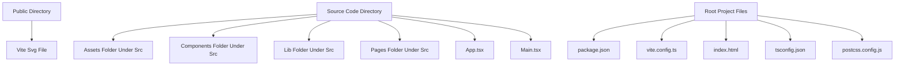

# NVR Imaging Website

A React and Vite based single-page website for NVR Imaging. This project presents a personal/company site with sections such as Home, About, Services, Longevity, FAQ, and Contact, implemented with React, TypeScript, and Tailwind CSS.

## Architecture Overview

## Tech Stack

- Languages: TypeScript, JavaScript, HTML, CSS
- Frontend: React
- Styling: Tailwind CSS
- Routing: React Router
- Animations: Framer Motion
- Icons: lucide-react
- Build / Tooling: Vite, ESLint, PostCSS
- Utilities: clsx, tailwind-merge

## Getting Started / How to Run

The project exposes the following scripts in package.json. Use these commands as listed:

- Install dependencies
  - npm install
- Run in development mode
  - npm run dev
- Build for production
  - npm run build
- Preview production build locally
  - npm run preview

Notes:
- The build script runs TypeScript compilation first (tsc -b) and then Vite build.
- Ensure Node.js environment is available in your development setup to run Vite and TypeScript tooling.

## Project Structure

- public: Static assets such as the Vite SVG file
- src
  - assets: Images and assets (e.g., react.svg, somwaru.jpg, viswanadhan.jpeg)
  - components: Reusable components
    - layout: Footer.tsx, Layout.tsx, Navbar.tsx
  - lib: Utilities like utils.ts
  - pages: Page components including Home.tsx, About.tsx, Services.tsx, Longevity.tsx, FAQ.tsx, Contact.tsx
  - App.css, App.tsx, index.css, main.tsx: Core application files and styling
- Root files (at repository root)
  - package.json, vite.config.ts, index.html, postcss.config.js, tailwind.config.js, tsconfig.json, etc.

Key directories and files described:
- src/assets: Centralized static assets used by pages and components
- src/components/layout: Shared layout components such as Navbar, Layout, and Footer
- src/lib/utils.ts: Helper utilities used across pages
- src/pages: Individual page components for Home, About, Services, Longevity, FAQ, and Contact
- package.json: Defines development, build, lint, and preview scripts
- vite.config.ts, tsconfig.json and related config files: Project configuration for TypeScript and Vite

## Contributing

We welcome contributions. To contribute:

- Fork the repository
- Create a new branch for your feature/bugfix
- Implement tests where applicable
- Run npm install to install dependencies
- Run npm run dev to test locally
- Ensure your changes pass linting (npm run lint)
- Submit a PR with a clear description of changes

Thank you for your interest in improving NVR Imaging Website!